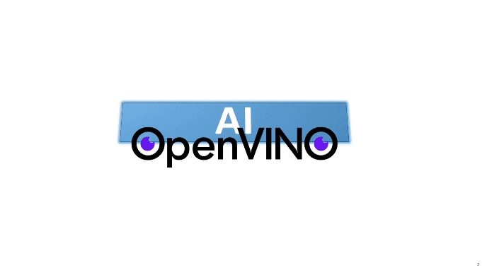

# Hi there! I'm Jonathan :)👋

💞 Enjoy Life. Lifelong learner. 😊🗻🌍

💡 Always learning. Always innovating. Let’s connect and build the future with AI & DevOps.

🚀 AI | Generative AI | DevOps | MLOps | Edge AI

Passionate about AI-driven innovation, cloud-native DevOps, and MLOps automation - bridging the gap between cutting-edge AI models and scalable deployment. I thrive in fast-paced environments, leveraging Generative AI, Deep Learning, and DevOps best practices to support customer to build intelligent, production-ready solutions.

**Keep practicing to get into the habit of embracing VUCA (Volatility, Uncertainty, Complexity, Ambiguity).💪 
Dedicating to advocate DIB (Diversity, Inclusion, Belonging)🌱**

## About me ... 
Generative AI, DevOps | Technical Trainer | Data Scientist | CNCF Kubestronaut: CKA, CKAD, CKS, KCNA, KCSA | RHCE | Edge AI & MLOps Professional | Certified TensorFlow Developer | OpenCV TF Honorable Certificate | PMP 

:clap::clap::clap: **Certified ...** 
[TensorFlow Developer](https://www.tensorflow.org/certificate), [OpenCV Deep Learning with TensorFlow and Keras](https://opencv.org/courses/) 
[Intel® Edge AI Developer](https://www.intel.com/content/www/us/en/developer/tools/devcloud/edge/learn/certification.html), [Intel® Certified Developer-MLOps Professional
](https://www.intel.com/content/www/us/en/developer/certification/mlops.html) 
[CKA](https://training.linuxfoundation.org/certification/certified-kubernetes-administrator-cka/)|[CKAD](https://training.linuxfoundation.org/certification/certified-kubernetes-application-developer-ckad/)|[CKS](https://training.linuxfoundation.org/certification/certified-kubernetes-security-specialist/)|[KCNA](https://www.credly.com/badges/b724070d-5889-4bc3-beae-9ba4c8d94f3c)|[KCSA](https://www.credly.com/badges/30dc9214-1554-4004-b1fd-a918a3ea5deb)|[Kubestronaut](https://www.credly.com/badges/e4de2761-6d44-4198-8f53-1c45010ac207) 
[RHCE](https://www.redhat.com/en/services/training/ex294-red-hat-certified-engineer-rhce-exam-red-hat-enterprise-linux-8) 
[PMP®](https://www.pmi.org/certifications/project-management-pmp#) 
:clap::clap::clap: **Onward and Upward!**

:point_right:[View](https://www.credly.com/users/tung-chiang-yeh/badges) my earned badges from Credly👏✨

- :necktie: Senior DevOps/Python Software Engineer at [WPG Holdings](https://www.wpgholdings.com/)
- :earth_americas: I love writing Python, playing Linux, leveraging Docker, deploying by using Kubernetes
- :blush: Reported to be uxorious after marriage. Cat lover, especially for British Shorthair.

Attempting to find some time to renew the existing repo with updated API…🍕

*Hobbies: Exercising, Reading, Journalizing, Meditating, Traveling..*

<!--
**jonathanyeh0723/Jonathanyeh0723** is a ✨ _special_ ✨ repository because its `README.md` (this file) appears on your GitHub profile.

Here are some ideas to get you started:

- :necktie: I’m currently working on ...
- 🌱 I’m currently learning ...
- 👯 I’m looking to collaborate on ...
- 🤔 I’m looking for help with ...
- 💬 Ask me about ...
- 📫 How to reach me: ...
- 😄 Pronouns: ...
- ⚡ Fun fact: ...

#
-->

<!--
 
-->

